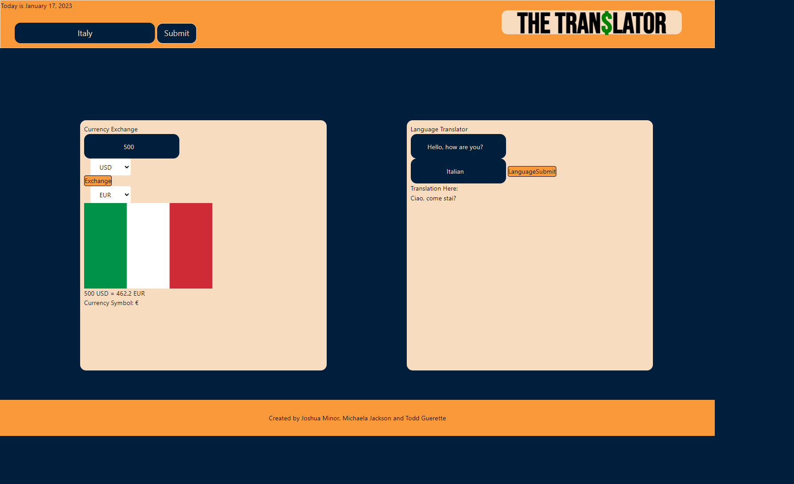

# The Tran$lator

## Description

The Tran$lator was created as an application to help users quickly learn about countries they may want to visit. When traveling there are a few things one must consider before departing on their journey. Namely, currency and language. Does the country you are visiting accept the US Dollar or does it take a different currency? Also, can you communicate with the locals so you can get from place to place? These are all questions we considered when creating and designing this application. 

In doing so, we have created an application that can instantly deliver quick facts about many countries users may want to visit. Using the search bar, users can input a country they would like to visit and that will populate the language field and second currency field. Users can then input the currency they use in the first field and our app will tell the user how much their currency is worth in their desired location. Users can also use the language translate feature to preview the language of the country they may wish to visit.

## Usage
[Click Here to Get Started](https://jminor90.github.io/the-translator/)

- Enter a country name in the search bar and begin your search.
- Use the first currency drop down menu to select the currency your country uses. If the user used the submit bar, then the second currency should already be populated for you; if not, choose a second currency from the drop down menu and input the amount you plan to take on your trip and click "Exchange". 
- The user should see their destination country flag, their currency exchange and the symbol for that countries currency. The tanslator side works similarly to the exchange side in that it will use the submit bar to populate one of the fields. 
- Users will notice if they used the submit bar the language or languages the countries use will be entered for you. Users can then enter in words or small phrases such as "How are you?" and "Hello World" to see that translated into their desired countries language. The website look was created using a combination of vanilla HTML and CSS as well as leveraging the Tailwind API for styling assistance.

## Features

- Up to date exchange rates
- Language translation from one language to another.
- Flag and currency symbol display

## Credits

Project Created by:
- Michaela Jackson: https://github.com/mijensine23
- Joshua Minor: https://github.com/jminor90
- Todd Guerette: https://github.com/Bucket12

Tools & APIs:
- https://www.exchangerate-api.com/
- https://cloud.google.com/translate
- https://restcountries.com/
- https://tailwindcss.com/
- https://www.w3schools.com/
- https://day.js.org/
- https://jquery.com/

## License

MIT License see LICENSE for more information

